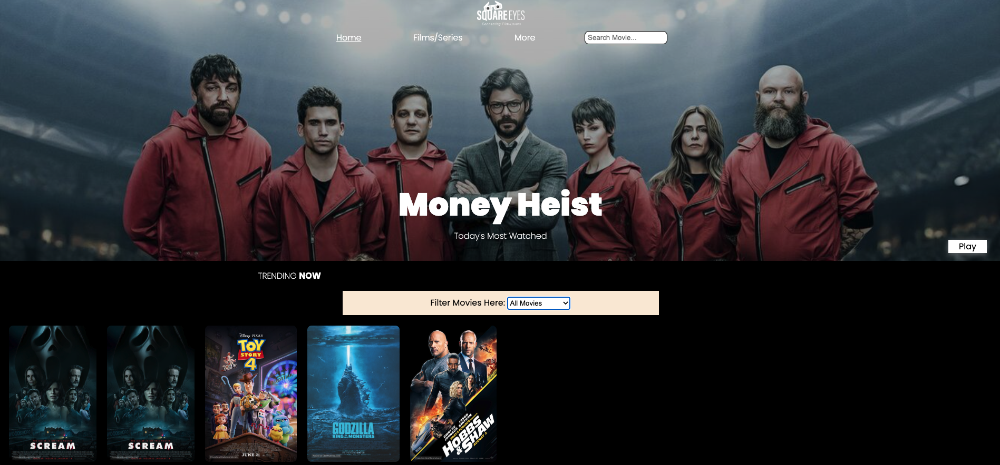

# Cross course Project



A simple overview of the use/purpose of the project.

## Description

A movie website was made for the cross course project.

## Built With

- HTML
- CSS
- [JavaScript](https://www.javascript.com/)

## Getting Started

### Installing

1. Clone the repo:

```bash
git clone https://github.com/Sayed-Nabil-Habib/Cross-course-project-re-design
```

### Running

To run the blog, simply download the live server extention on VS code and right click on any html file and click on "open with live server".

## Contributing

I appreciate your interest in contributing to our travel blog! Even small contributions can make a difference. Here's how you can contribute:

Fork the repository.
Make your desired changes or additions.
Submit a pull request.

That's it! I will review your contribution and merge it if it aligns with the goals and style of my travel blog.

If you have any questions or need assistance, feel free to reach out to me. Thank you for your support!
